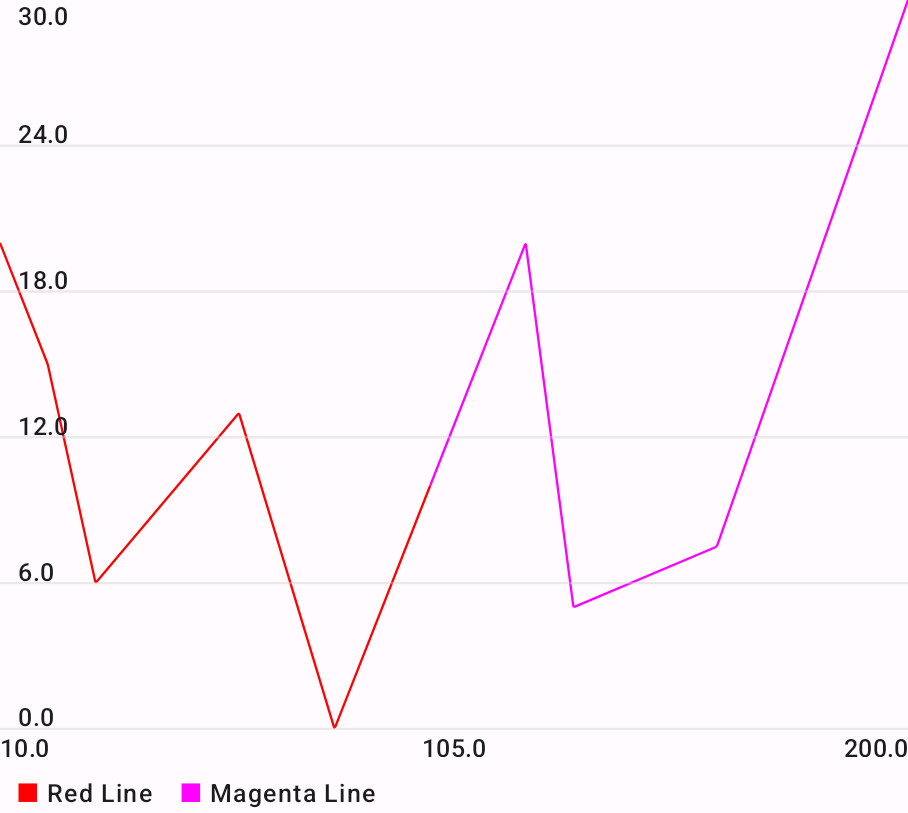
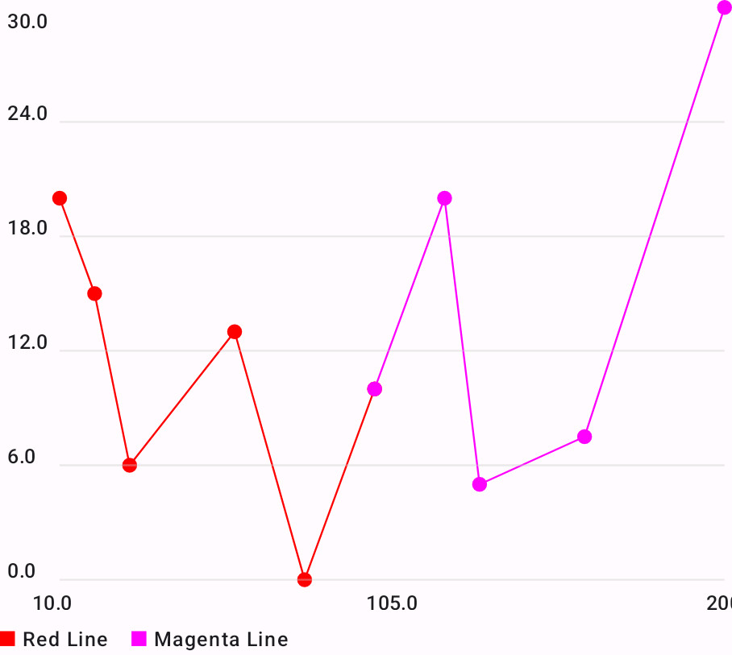

# Jetpack Compose Live Line Chart
A line chart using Jetpack Compose, optimized for live data.

## Gradle Setup
In your settings.gradle file, add the following:
```gradle
dependencyResolutionManagement {
    ...
    repositories {
        ...
        maven { url 'https://www.jitpack.io' }
    }
}
```

Next, add the library dependency to your app build.gradle:
```gradle
dependencies {
    ...
    implementation 'com.github.maximilianproell:compose-live-line-chart:1.1'
}
```

## Usage
Here is an example code snippet to create a basic line chart:
```kotlin
LineChart(
    lineDataSets = {
        listOf(
            LineDataSet(
                name = "Red Line",
                dataPoints = listOf(
                    DataPoint(10F, 20F),
                    DataPoint(20F, 15F),
                    DataPoint(30F, 6F),
                    DataPoint(60F, 13F),
                    DataPoint(80F, 0F),
                    DataPoint(100F, 10F),
                ),
                lineColor = Color.Red
            ),
            LineDataSet(
                name = "Magenta Line",
                dataPoints = listOf(
                    DataPoint(100F, 10F),
                    DataPoint(120F, 20F),
                    DataPoint(130F, 5F),
                    DataPoint(160F, 7.5F),
                    DataPoint(200F, 30F),
                ),
                lineColor = Color.Magenta,
            ),
        )
    },
    maxVisibleYValue = 30f,
    xAxisConfig = AxisConfigDefaults.xAxisConfigDefaults().copy(
        labelsYOffset = 12.dp,
        axisColor = Color.Black,
        allowBorderTextClipping = false
    ),
    yAxisConfig = AxisConfigDefaults.yAxisConfigDefaults().copy(
        numberOfLabels = 6,
        labelsXOffset = 8.dp
    ),
    lineConfig = LineConfigDefaults.lineConfigDefaults().copy(showLineDots = false)
)
```
The resulting chart looks as follows:


The parameters can be changed to your needs. E.g., you can change the x-axis and y-axis configurations and adapt the 
paddings. The paddings may be positive or negative. If we change the `labelsXOffset` of the yAxisConfig to `(-28).dp` (y-axis
labels are drawn outside of the chart),
and `showLineDots = true` for the line config, we get the following result:


To learn about all parameters and possible configuration changes, please study the KDoc of this library.

### Live Data
Regarding the LineChart composable, the data is passed inside a lambda. This prevents the LineChart from recomposing when 
only the chart content has changed.
The demo App uses the following code in the MainActivity to display live data:
```kotlin
val chartData by viewModel.chartData.collectAsState(initial = emptyList())

Surface(modifier = Modifier.fillMaxSize()) {
    LineChart(
        modifier = Modifier.padding(16.dp),
        lineDataSets = { chartData },
        // ...
    )
}
```
For more implementation details, please study the demo App provided with
this library.

The result is the following:

