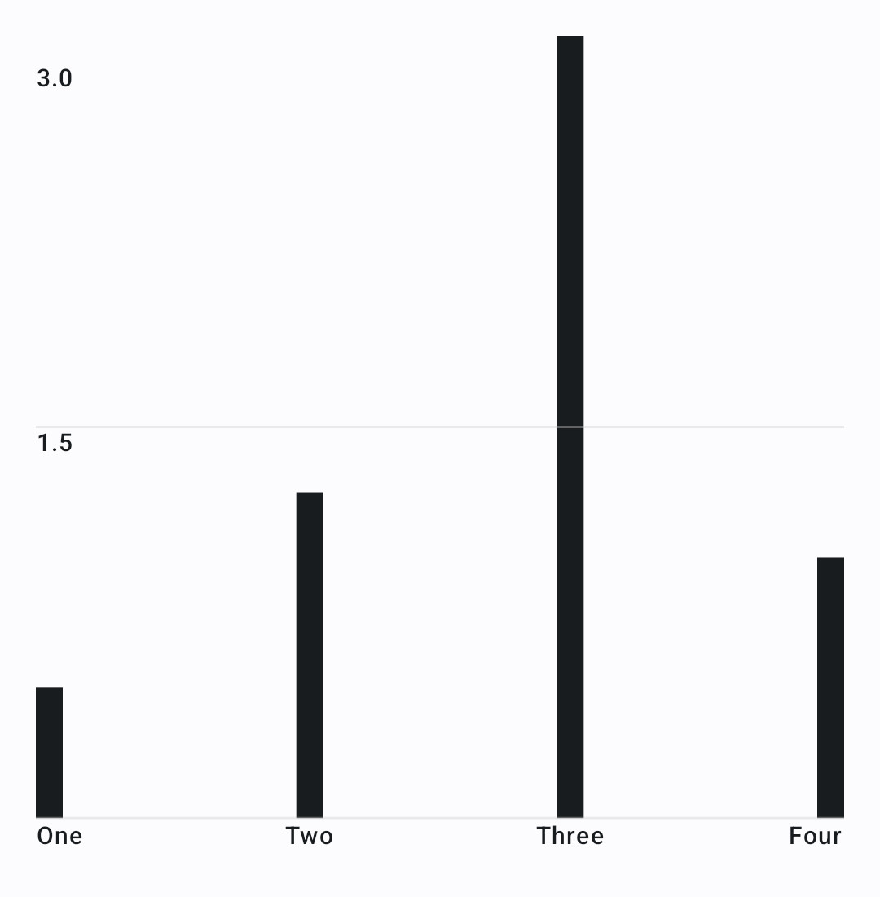

# Compose Multiplatform Chart
A compose multiplatform chart library targeting Android and iOS. 

## Features
As of now, two chart types are supported:
- Line chart (optimized versions for live data and huge datasets available)
- Bar chart

## Gradle Setup
In your settings.gradle file, make sure that mavenCentral is part of your repositories:
```gradle
dependencyResolutionManagement {
    repositories {
        mavenCentral()
        ...
    }
}
```

Next, add the library dependency to your app build.gradle:
```gradle
dependencies {
    ...
    implementation "io.github.maximilianproell:compose-multiplatform-chart:2.1.0"
}
```
Or, in case of a multiplatform project, add it to the `commonMain` source set:
```gradle
sourceSets {
    val commonMain by getting {
        dependencies {
            implementation("io.github.maximilianproell:compose-multiplatform-chart:2.1.0")
        }
    }
    ...
}
```

## Usage
### Line chart
Here is an example code snippet to create a basic line chart:
```kotlin
LineChart(
    lineDataSets =
        listOf(
            LineDataSet(
                name = "Red Line",
                dataPoints = listOf(
                    DataPoint(10F, 20F),
                    DataPoint(20F, 15F),
                    DataPoint(30F, 6F),
                    DataPoint(60F, 13F),
                    DataPoint(80F, 0F),
                    DataPoint(100F, 10F),
                ),
                lineColor = Color.Red
            ),
            LineDataSet(
                name = "Magenta Line",
                dataPoints = listOf(
                    DataPoint(100F, 10F),
                    DataPoint(120F, 20F),
                    DataPoint(130F, 5F),
                    DataPoint(160F, 7.5F),
                    DataPoint(200F, 30F),
                ),
                lineColor = Color.Magenta,
            ),
        ),
    maxVisibleYValue = 30f,
    xAxisConfig = AxisConfigDefaults.xAxisConfigDefaults().copy(
        labelsYOffset = 12.dp,
        axisColor = Color.Black,
        allowBorderTextClipping = false
    ),
    yAxisConfig = AxisConfigDefaults.yAxisConfigDefaults().copy(
        numberOfLabels = 6,
        labelsXOffset = 8.dp
    ),
    lineConfig = LineConfigDefaults.lineConfigDefaults().copy(showLineDots = false)
)
```
The resulting chart looks as follows:


The parameters can be changed to your needs. E.g., you can change the x-axis and y-axis configurations and adapt the paddings. The paddings may be positive or negative. If we change the `labelsXOffset` of the yAxisConfig to `(-28).dp` (y-axis labels are drawn outside of the chart), and `showLineDots = true` for the line config, we get the following result:


To learn about all parameters and possible configuration changes, please study the KDoc of this library.

#### Live Data
For live data, use the `LiveLineChart` composable, where the data is passed inside a lambda. This prevents the LineChart from recomposing when only the chart content has changed. The demo App uses the following code in the MainActivity to display live data:
```kotlin
val chartData by viewModel.chartData.collectAsState(initial = emptyList())

Surface(modifier = Modifier.fillMaxSize()) {
    LiveLineChart(
        modifier = Modifier.padding(16.dp),
        lineDataSets = { chartData },
        // ...
    )
}
```
For more implementation details, please study the demo App provided with this library.

The result is the following:


#### Big datasets
For big datasets, simply use the aforementioned `LineChart` composable. Pinch to zoom is automatically activated. The sample Android App comes with a heart rate dataset with over 600 hours of data (over 2 million data points). While exploring the data through gestures, the `LineChart` automatically reloads the data and downsamples it using the Largest Triangle Three Buckets (LTTB) alogorithm:


### Bar chart
A basic bar chart can be created with the following code:
```kotlin
BarChart(
    modifier = Modifier.fillMaxSize().padding(16.dp),
    entries = listOf(
        BarChartEntry("One", 0.5f),
        BarChartEntry("Two", 1.25f),
        BarChartEntry("Three", 3f),
        BarChartEntry("Four", 1f),
    ),
    maxYValue = 3f,
    barConfig = defaultBarConfig.copy(animate = true),
)
```

And the result:

